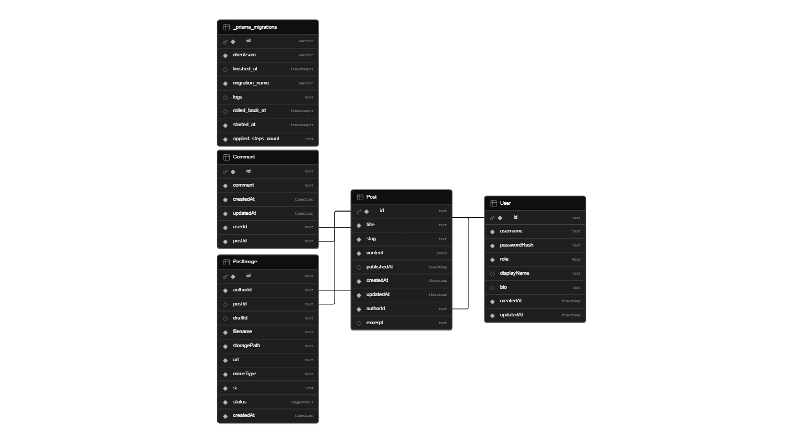
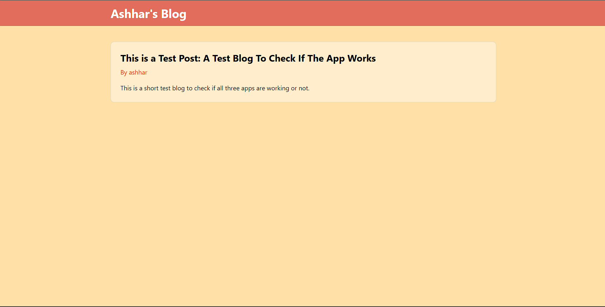
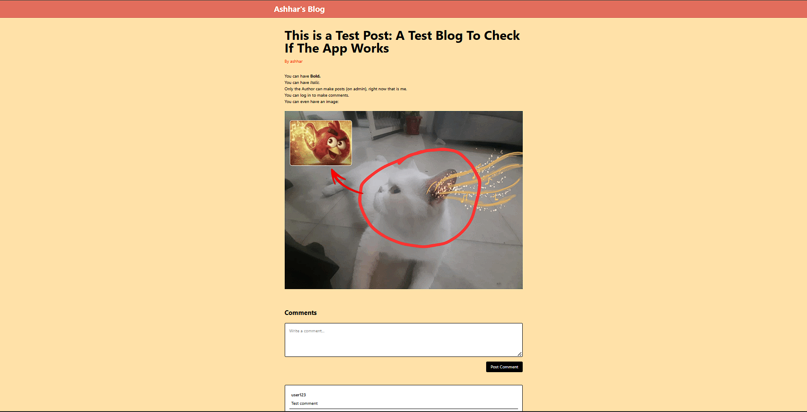
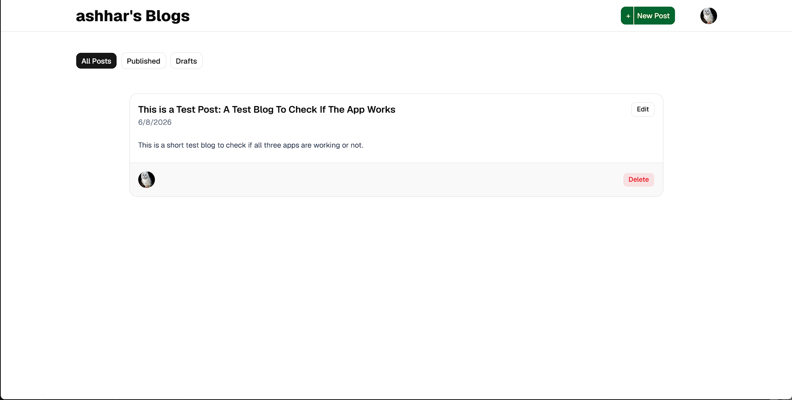
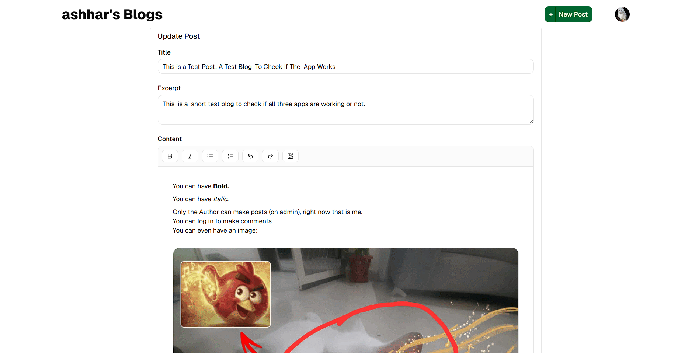

# Blog Platform

> Full-stack publishing platform with a dedicated author dashboard, public reader application, rich text editing, image uploads, comments, authentication, and role-based access control.

---

## Live Demo

### Reader Application
https://blog-site-reader.vercel.app

### Author Dashboard
https://blog-site-admin.vercel.app

> Author accounts are restricted. Only users with the `AUTHOR` role can create, edit, publish, or delete blog posts.

---

## Features

### Reader App

- Browse published blog posts
- Read rich text articles
- View post authors and publication dates
- Comment on posts
- Login/register modal for commenting
- Responsive reading experience

### Author Dashboard

- Secure authentication
- Create draft posts
- Rich text editor powered by Tiptap
- Inline image uploads
- Publish/unpublish workflow
- Edit existing posts
- Delete posts
- Manage comments
- Filter published and draft posts

### Media Management

- Direct-to-storage image uploads
- Supabase Storage integration
- Upload progress indicators
- Draft-safe image handling
- Automatic image association during publishing

---

## Architecture

### Monorepo Structure

```txt
apps/
├── backend/
├── admin/
└── reader/
```

### Backend

```txt
Express
│
├── Authentication
├── Posts
├── Comments
├── Image Uploads
└── Prisma ORM
```

### Frontend Applications

```txt
Admin Dashboard
│
├── Authentication
├── Post Management
├── Image Uploads
└── Comment Moderation

Reader Application
│
├── Post Listing
├── Article Pages
├── Comments
└── Authentication
```

---

## Tech Stack

### Backend

- Express.js
- TypeScript
- Prisma ORM
- PostgreSQL
- JWT Authentication
- bcryptjs
- Zod

### Frontend

#### Admin Dashboard

- React
- TypeScript
- Vite
- React Router
- TanStack Query
- Tiptap Editor
- Tailwind CSS
- shadcn/ui
- Lucide React

#### Reader Application

- React
- TypeScript
- Vite
- React Router
- TanStack Query
- Tailwind CSS
- Lucide React

### Storage

- Supabase Storage
- Signed Upload URLs

### Deployment

- Railway (Backend)
- Vercel (Admin)
- Vercel (Reader)

### Tooling

- Turborepo
- GitHub Actions
- ESLint
- Prettier

---

## Key Implementation Details

### Rich Text Editing

Posts are authored using Tiptap and stored as JSON instead of HTML.

Benefits:

- Structured content
- Easier editor integrations
- Future editor extensibility
- Safer rendering

---

### Image Upload Architecture

Images are uploaded directly to Supabase Storage using signed upload URLs.

Flow:

```txt
Client
│
├── Request signed upload URL
│
├── Upload image directly to Supabase
│
├── Create image record
│
└── Insert image into editor
```

This avoids routing binary uploads through the Express server.

---

### Authentication

Authentication uses:

- JWT access tokens
- Role-based authorization
- Protected author routes

Roles:

```txt
VIEWER
AUTHOR
```

Only authors can:

- Create posts
- Edit posts
- Publish posts
- Delete posts

---

## Database Design

### Core Models

- User
- Post
- Comment
- PostImage

### ERD

> Insert Prisma ERD screenshot here



---

## Screenshots

### Reader Application

> Insert screenshot



---

### Post Page

> Insert screenshot



---

### Author Dashboard

> Insert screenshot



---

### Rich Text Editor

> Insert screenshot



---

## Environment Variables

### Backend

```env
DATABASE_URL=

DIRECT_URL=

JWT_SECRET=

SUPABASE_URL=

SUPABASE_SERVICE_ROLE_KEY=

SUPABASE_BUCKET=
```

### Admin

```env
VITE_API_URL=
```

### Reader

```env
VITE_API_URL=
```

---

## Running Locally

### Clone Repository

```bash
git clone <repo-url>
cd blog-site
```

### Install Dependencies

```bash
npm install
```

### Generate Prisma Client

```bash
cd apps/backend

npx prisma generate
```

### Run Migrations

```bash
npx prisma migrate dev
```

### Start Backend

```bash
npm run dev
```

### Start Admin Dashboard

```bash
cd apps/admin

npm run dev
```

### Start Reader App

```bash
cd apps/reader

npm run dev
```

---

## Future Improvements

- User profiles
- Post likes/bookmarks
- Search functionality
- Categories and tags
- SEO metadata management
- Markdown import/export
- Draft autosave
- Email notifications
- Rich image galleries

---

## Challenges Solved

- Implemented direct-to-storage uploads using Supabase signed upload URLs
- Built a draft-safe image upload workflow for unpublished posts
- Designed role-based authorization between readers and authors
- Managed rich text content using Tiptap JSON documents
- Coordinated a monorepo containing multiple frontend applications and a shared backend

---

## Lessons Learned

- Monorepo application structure
- Direct browser-to-storage upload architectures
- Rich text editor integrations
- Query invalidation with TanStack Query
- Production deployment across Railway and Vercel